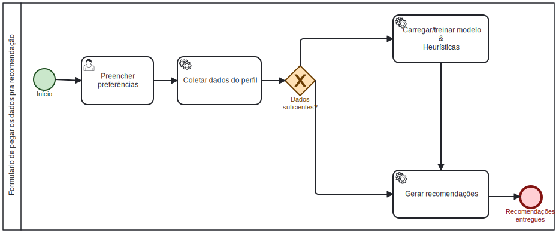

# Modelagem BPMN do software

## Visão Geral do Software

<iframe frameborder="0" style="width:100%;height:700px;" src="https://viewer.diagrams.net/?tags=%7B%7D&lightbox=1&highlight=0000ff&edit=_blank&layers=1&nav=1&title=BPMN.drawio&dark=0#Uhttps%3A%2F%2Fdrive.google.com%2Fuc%3Fid%3D14QOnyi6LAwzV1oqo-rRltceFVsR-ImLg%26export%3Ddownload"></iframe>

A cima é possível visualizar o diagrama BPMN completo do software, que abrange todas as funcionalidades principais, incluindo acesso ao sistema, registro, login, recuperação de senha, edição de perfil, coleta de dados para recomendações e processo de avaliação de livros.

---

# Detalhamento dos Subfluxos

## Fazer registro

 Modelagem BPMN - Fazer registro 

O processo começa com a escolha do tipo de conta, onde o usuário seleciona se deseja criar uma conta com seu email ou através de serviços de terceiros. Caso o usuário opte por criar uma conta com email, um código de uso único é enviado para o endereço informado. Esse código tem um tempo de validade, e caso expire, um novo código é enviado. Se o código inserido estiver errado, o sistema solicita que o usuário insira o código novamente. Após a verificação do código, o sistema realiza a autenticação dos dados, verificando se o nome de usuário e a senha estão corretos, além de checar se o nome de usuário já não está em uso. Se todas as informações estiverem corretas, a criação da conta é concluída e o usuário é redirecionado para a tela inicial da aplicação.

## Fazer login

 Modelagem BPMN - Fazer login 

O sistema oferece a opção de criar conta caso o usuário ainda não tenha um cadastro. Se o usuário optar por criar uma conta, ele é redirecionado para um subfluxo de registro. Durante o processo de autenticação de dados, o sistema verifica as informações fornecidas, como email/nome de usuário e senha. Se os dados estiverem corretos, o usuário é redirecionado para a tela inicial da aplicação. Caso o usuário deseje alterar a senha, é exibida a opção para solicitar a alteração, o que o redireciona para o fluxo de alteração de senha.

## Esqueci minha senha

 Modelagem BPMN - Esqueci minha senha 

O sistema inicia a verificação de email, conferindo se o endereço informado para a alteração de senha está registrado. Caso o email não exista no banco de dados, o usuário é redirecionado para o fluxo de login. Se o email for válido, o sistema envia um código único para o endereço informado. Após o usuário receber o código, ele deve inseri-lo no sistema, e então poderá definir sua nova senha, confirmando a alteração.

## Editar perfil

 Modelagem BPMN - Editar perfil 

Este diagrama BPMN detalha o processo de edição de perfil do usuário. O fluxo inicia quando depois de "Acessar Página de perfil" o usuário acessa a funcionalidade de "Editar perfil". Em seguida, o usuário pode modificar suas informações pessoais, como nome usuário, nome de cadastro ou foto. Após realizar as alterações desejadas, o usuário confirma a edição. O sistema então valida os dados inseridos. Caso os dados estejam corretos, as informações são atualizadas no banco de dados e uma mensagem de sucesso é exibida ao usuário. Se houver algum erro na validação, o sistema solicita a correção dos dados, permitindo que o usuário tente novamente.

Autor: [Henrique Quenino](https://github.com/henriquecq)  2025.

## Formulário para obtenção de dados do usuário pra recomendação

<!-- Modelagem BPMN do software de formulário -->

 Modelagem BPMN - formulário 

Este diagrama BPMN ilustra o fluxo de coleta de dados do usuário para a geração de recomendações. O processo inicia com o usuário "Preencher preferências" em um formulário. Após o preenchimento, o sistema prossegue para "Coletar dados do perfil" do usuário. Em seguida, uma verificação é realizada no *gateway* "Dados suficientes?" para determinar se as informações coletadas são adequadas.

Independentemente do resultado dessa verificação, o fluxo segue para "Carregar/treinar modelo & Heurísticas", onde o modelo de recomendação é preparado ou ajustado, e as heurísticas são consideradas. Posteriormente, o sistema realiza a tarefa de "Gerar recomendações". O processo é finalizado com a entrega das "Recomendações entregues" ao usuário.

Autores: [Iago Rocha](https://github.com/iagorrr) & [Pedro Braga](https://github.com/Stain19) 2025.

## Processo de avaliação

 Modelagem BPMN - formulário 

O diagrama BPMN demonstra o fluxo de um usuário para fazer uma avaliação de livro no sistema. O processo começa com o usuário selecionando o livro e sendo redirecionado para uma tela de avaliação. Após isso, o usuário envia a avaliação, que chega para o sistema (que recebe a avaliação) . Posteriormente, é realizada uma verificação, que em caso do dados serem válidos, serão armazenados no banco de dados, gerando uma atualização no script de recomendações e por fim disponibilizando para a visualização da resenha realizada.

Autores: [Jose Eduardo](https://github.com/jevprado) & [Renan Vieira](https://github.com/R-enanVieira) 2025.

### Histórico de versão

| Versão | Data | Descrição | Autor(es) |
|--------|------|-----------|-----------|
| 1.0 | 04/09/2025 | Adiciona modelagem BPMN da parte de formulário |  [Iago Rocha](https://github.com/iagorrr) |
| 1.1 | 05/09/2025 | Adiciona e detalha a descrição da modelagem BPMN do formulário |  [Pedro Braga](https://github.com/Stain19) |
| 1.2 | 05/09/2025 | Adiciona e detalha a descrição da modelagem BPMN da avaliação/resenha |  [Jose Eduardo](https://github.com/jevprado) e [Renan Vieira](https://github.com/R-enanVieira) |
| 1.3 | 05/09/2025 | Adiciona BPMN visão geral   | [Tiago Antunes](https://github.com/TiagoBalieiro) e [Gabriel Castelo](https://github.com/GabrielCastelo-31) |
| 1.4 | 05/09/2025 | Adiciona e detalha a descrição da modelagem BPMN de Solicitar Alteração de Senha e edição de perfil | [Gabriel Castelo](https://github.com/GabrielCastelo-31) |
| 1.5 | 05/09/2025 | Adiciona e detalha modelagem BPMN de Fazer Login | [Henrique Quenino](https://github.com/henriquecq) |
| 1.6 | 05/09/2025 | Adiciona e detalha modelagem BPMN de Fazer Registro | [Tiago Antunes](https://github.com/TiagoBalieiro) |
| 1.7 | 05/09/2025 | Adição de detalhamento de Subfluxos | [Tiago Antunes](https://github.com/TiagoBalieiro) |
| 1.8 | 05/09/2025 | Adição e correção do detalhamento dos subfluxos BPMN | [Henrique Quenino](https://github.com/henriquecq) |
