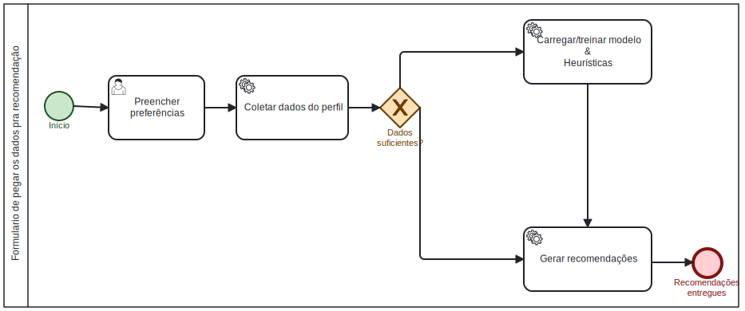

# Modelagem BPMN do software

## Formulario de pegar os dados pra recomendação 

<!-- Modelagem BPMN do software de formulário -->

 Modelagem BPMN - formulário 

Autores: [Iago Rocha](https://github.com/iagorrr) & [Pedro Braga](https://github.com/Stain19) 2025.

### Histórico de versão

| Versão | Data | Descrição | Autor(es) |
|--------|------|-----------|-----------|
| 1.0 | 04/09/2025 | Adiciona modelagem BPMN da parte de formulário |  [iagorrr]() |
