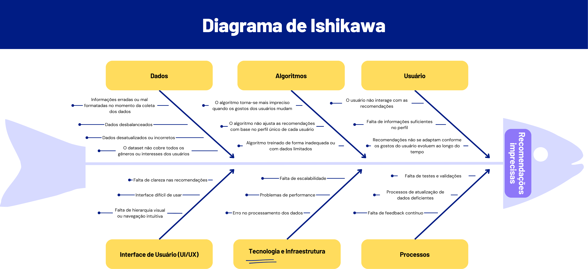

# 1.1.2. Sketch

## O que é a Etapa Sketch?

A fase de Sketch (Esboço), tradicionalmente, foca na geração individual de ideias e soluções visuais para o problema definido no sprint. O objetivo é estimular a criatividade de cada participante, que de forma independente, desenha propostas para responder à questão central do sprint. Essa abordagem garante uma variedade de soluções sem a interferência ou o viés inicial do grupo.

No contexto do nosso projeto **EuRecomendo**, adaptamos a fase de Sketch de forma estratégica para produzir uma série de artefatos generalistas que são fundamentais para a compreensão aprofundada do problema e a construção da solução. Essa adaptação nos permitiu documentar as análises e decisões iniciais da equipe, servindo como base para as fases subsequentes do desenvolvimento.

Os artefatos gerados nesta fase contribuem para uma visão abrangente do cenário, desde a identificação das causas-raiz até a definição de termos e conceitos importantes para o projeto. Abaixo, são apresentados os principais artefatos desenvolvidos durante essa etapa:

## Glossário

### Domínio do Problema

**[Algoritmo de Recomendação](#algoritmo-de-recomendacao)**
Sistema inteligente que analisa preferências e comportamentos do usuário para sugerir livros personalizados.

**[Avaliação](#avaliacao)**
Sistema de classificação por estrelas (1 a 5) que permite aos usuários expressar sua opinião sobre um livro lido.

**[Comunidade de Leitores](#comunidade-de-leitores)**
Conjunto de usuários da plataforma que compartilham resenhas, avaliações e recomendações de livros.

**[Dataset de Livros](#dataset-de-livros)**
Base de dados contendo informações detalhadas sobre livros, incluindo título, autor, gênero, sinopse e metadados.

**[Feed de Recomendações](#feed-de-recomendacoes)**
Página principal personalizada que exibe sugestões de livros baseadas no perfil e histórico do usuário.

**[Gênero Literário](#genero-literario)**
Categoria que classifica livros por estilo, como ficção, não ficção, romance, terror, biografia, etc.

**[Perfil do Usuário](#perfil-do-usuario)**
Conjunto de informações sobre preferências literárias, histórico de leituras e avaliações do usuário.

**[Questionário Inicial](#questionario-inicial)**
Formulário de onboarding que coleta preferências iniciais do usuário para criar seu perfil personalizado.

**[Recomendação Personalizada](#recomendacao-personalizada)**
Sugestão de livro gerada especificamente para um usuário com base em seus interesses e comportamentos.

**[Resenha](#resenha)**
Texto opinativo escrito pelo usuário sobre um livro, compartilhando sua experiência de leitura.

**[Sistema de Tags](#sistema-de-tags)**
Funcionalidade que permite categorizar e organizar livros com palavras-chave específicas.

**[Usuário](#usuario)**
Pessoa cadastrada na plataforma que busca recomendações de livros e participa da comunidade.

### Domínio Técnico

**[API Externa](#api-externa)**
Interface de programação que permite integração com bases de dados de livros de terceiros (como Google Books API).

**[Algoritmo de Machine Learning](#algoritmo-de-machine-learning)**
Técnicas de aprendizado de máquina utilizadas para melhorar a precisão das recomendações ao longo do tempo.

**[Análise de Sentimento](#analise-de-sentimento)**
Processamento de linguagem natural aplicado às resenhas para extrair insights sobre a recepção dos livros.

**[Autenticação](#autenticacao)**
Processo de verificação da identidade do usuário através de login, senha ou OAuth.

**[Backend](#backend)**
Camada do servidor responsável pela lógica de negócios, processamento de dados e comunicação com banco de dados.

**[Banco de Dados](#banco-de-dados)**
Sistema de armazenamento que mantém informações sobre usuários, livros, resenhas e interações.

**[CRUD](#crud)**
Operações básicas do sistema: Create, Read, Update, Delete (Criar, Ler, Atualizar, Apagar).

**[Frontend](#frontend)**
Interface de usuário responsável pela apresentação visual e interação com a aplicação.

**[Gamificação](#gamificacao)**
Implementação de elementos de jogos (badges, pontos, níveis) para incentivar engajamento dos usuários.

**[Responsividade](#responsividade)**
Capacidade da interface de se adaptar a diferentes dispositivos (desktop, tablet, smartphone).

**[Session/Token](#session-token)**
Mecanismo de autenticação que mantém o usuário logado e valida suas requisições.

**[Sistema de Busca](#sistema-de-busca)**
Funcionalidade que permite localizar livros por título, autor, gênero ou palavras-chave.

Os detalhes sobre o processo de desenvolvimento deste Glossário, incluindo a metodologia de colaboração e a justificativa para a escolha de cada termo, estão documentados no tópico [1.2.1. Glossário](/Base/1.2.ArtefatoGeneralista.md#glossario). Lá, você encontrará a análise completa que serviu como base para a criação deste artefato, explicando como os termos de domínio do problema e técnico foram selecionados para garantir uma linguagem unificada para a equipe.

## Diagrama de Ishikawa

**Figura 1: Diagrama de Ishikawa - Análise de Causas para Recomendações Imprecisas**

O [Diagrama de Ishikawa](https://www.canva.com/design/DAGx4LIMXfc/Mip5tQy3aSNcipDsO-WOfw/edit?utm_content=DAGx4LIMXfc&utm_campaign=designshare&utm_medium=link2&utm_source=sharebutton) acima identifica as principais causas que podem levar a **[recomendações imprecisas](#recomendacao-personalizada)** no sistema EuRecomendo. As causas foram organizadas em seis categorias principais:

### **[Dados](#dataset-de-livros):**
- Informações erradas ou mal formatadas no momento da coleta dos dados
- Dados desbalanceados
- Dados desatualizados ou incorretos
- O dataset não cobre todos os gêneros ou interesses dos usuários

### **[Algoritmos](#algoritmo-de-recomendacao):**
- O algoritmo torna-se mais impreciso quando os gostos dos usuários mudam
- O algoritmo não ajusta as recomendações com base no perfil único de cada usuário
- Algoritmo treinado de forma inadequada ou com dados limitados

### **[Usuário](#usuario):**
- O usuário não interage com as recomendações
- Falta de informações suficientes no [perfil](#perfil-do-usuario)
- Recomendações não se adaptam conforme os gostos do usuário evoluem ao longo do tempo

### **Interface de Usuário (UI/UX):**
- Falta de clareza nas recomendações
- Interface difícil de usar
- Falta de hierarquia visual ou navegação intuitiva

### **Tecnologia e Infraestrutura:**
- Falta de escalabilidade
- Problemas de performance
- Erro no processamento dos dados

### **Processos:**
- Falta de testes e validações
- Processos de atualização de dados deficientes
- Falta de feedback contínuo

Os detalhes sobre o processo de desenvolvimento deste Diagrama de Ishikawa, que incluiu uma fase individual e uma etapa de convergência de ideias, estão documentados no tópico [1.2.2. Diagrama de Ishikawa](/Base/1.2.ArtefatoGeneralista.md#diagrama-de-ishikawa). Neste tópico, você poderá aprofundar a análise de cada causa-raiz, entender o senso crítico da equipe e as justificativas que levaram à sua consolidação, além de uma reflexão sobre a colaboração na sua construção.

## Histórico de Versões

| Versão | Data | Descrição | Autor(es) | Revisor(es) | Detalhes da Revisão |
|--------|------|-----------|-----------|-------------|-------------------|
| 1.0 | 03/09/2025 | Criação da página Sketch | [Euller Júlio](https://github.com/potatoyz908) | [Tiago Antunes](https://github.com/TiagoBalieiro) | Estrutura inicial com desenvolvimento do tópico, glossário e diagrama de Ishikawa |
