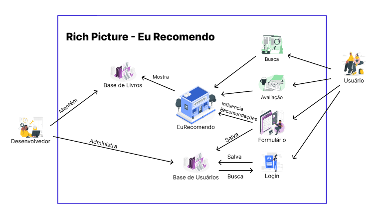
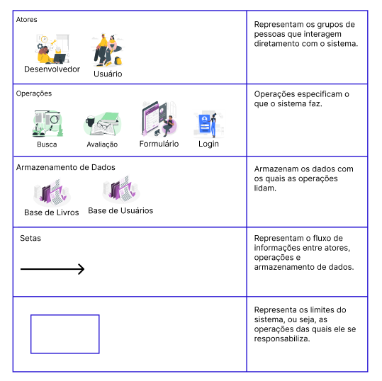

# 1.1.2. Sketch

## O que é a Etapa Sketch?

A fase de Sketch (Esboço), tradicionalmente, foca na geração individual de ideias e soluções visuais para o problema definido no sprint. O objetivo é estimular a criatividade de cada participante, que de forma independente, desenha propostas para responder à questão central do sprint. Essa abordagem garante uma variedade de soluções sem a interferência ou o viés inicial do grupo.

No contexto do nosso projeto **EuRecomendo**, adaptamos a fase de Sketch de forma estratégica para produzir uma série de artefatos generalistas que são fundamentais para a compreensão aprofundada do problema e a construção da solução. Essa adaptação nos permitiu documentar as análises e decisões iniciais da equipe, servindo como base para as fases subsequentes do desenvolvimento.

Os artefatos gerados nesta fase contribuem para uma visão abrangente do cenário, desde a identificação das causas-raiz até a definição de termos e conceitos importantes para o projeto. Abaixo, são apresentados os principais artefatos desenvolvidos durante essa etapa:

  
<strong>🐟 Diagrama de Ishikawa - Euller Júlio</strong>

## Diagrama de Ishikawa

**Figura 1: Diagrama de Ishikawa - Análise de Causas para Recomendações Imprecisas**

O [Diagrama de Ishikawa](https://www.canva.com/design/DAGx4LIMXfc/Mip5tQy3aSNcipDsO-WOfw/edit?utm_content=DAGx4LIMXfc&utm_campaign=designshare&utm_medium=link2&utm_source=sharebutton) acima identifica as principais causas que podem levar a **[recomendações imprecisas](#recomendacao-personalizada)** no sistema EuRecomendo. As causas foram organizadas em seis categorias principais:

### **[Dados](#dataset-de-livros):**
- Informações erradas ou mal formatadas no momento da coleta dos dados
- Dados desbalanceados
- Dados desatualizados ou incorretos
- O dataset não cobre todos os gêneros ou interesses dos usuários

### **[Algoritmos](#algoritmo-de-recomendacao):**
- O algoritmo torna-se mais impreciso quando os gostos dos usuários mudam
- O algoritmo não ajusta as recomendações com base no perfil único de cada usuário
- Algoritmo treinado de forma inadequada ou com dados limitados

### **[Usuário](#usuario):**
- O usuário não interage com as recomendações
- Falta de informações suficientes no [perfil](#perfil-do-usuario)
- Recomendações não se adaptam conforme os gostos do usuário evoluem ao longo do tempo

### **Interface de Usuário (UI/UX):**
- Falta de clareza nas recomendações
- Interface difícil de usar
- Falta de hierarquia visual ou navegação intuitiva

### **Tecnologia e Infraestrutura:**
- Falta de escalabilidade
- Problemas de performance
- Erro no processamento dos dados

### **Processos:**
- Falta de testes e validações
- Processos de atualização de dados deficientes
- Falta de feedback contínuo

Os detalhes sobre o processo de desenvolvimento deste Diagrama de Ishikawa, que incluiu uma fase individual e uma etapa de convergência de ideias, estão documentados no tópico [1.2.2. Diagrama de Ishikawa](/Base/1.2.ArtefatoGeneralista.md#diagrama-de-ishikawa). Neste tópico, você poderá aprofundar a análise de cada causa-raiz, entender o senso crítico da equipe e as justificativas que levaram à sua consolidação, além de uma reflexão sobre a colaboração na sua construção.

---

  
<strong>🎨 Rich Picture – Tiago Antunes</strong>

  <figure style="text-align: center; margin-top: 10px;">
    
    <figcaption style="font-size: 0.9rem; color: #555; margin-top: 5px;">
      Figura 2: Rich Picture do projeto EuRecomendo
    </figcaption>
  </figure>

  <figure style="text-align: center; margin-top: 10px;">
    
    <figcaption style="font-size: 0.9rem; color: #555; margin-top: 5px;">
      Figura 3: Legenda do Rich Picture
    </figcaption>
  </figure>

## Histórico de Versões

| Versão | Data | Descrição | Autor(es) | Revisor(es) | Detalhes da Revisão |
|--------|------|-----------|-----------|-------------|-------------------|
| 1.0 | 03/09/2025 | Criação da página Sketch | [Euller Júlio](https://github.com/potatoyz908) | [Tiago Antunes](https://github.com/TiagoBalieiro) | Estrutura inicial com desenvolvimento do tópico, glossário e diagrama de Ishikawa |
| 1.1 | 05/09/2025 | Adição do Rich Picture, e ajuste geral de formatação na página | [Tiago Antunes](https://github.com/TiagoBalieiro) | [Henrique Camelo Quenino](https://github.com/henriquecq) |  |