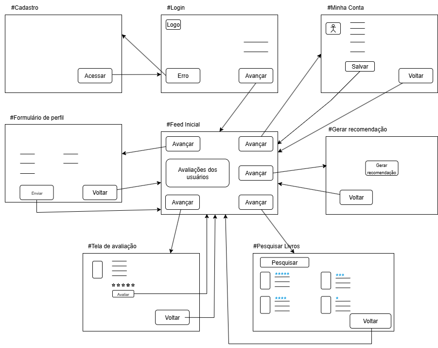

# 1.1.3. Decision

## O que foi feito ?

O objetivo desta etapa é identificar qual foi a melhor representação pelo Rich Picture dos fluxos do sistema EuRecomendo e a partir disso criar um StoryBoarding, cujo o papel é iniciar a discussão de como será o protótipo do site.

## Rich Picture 

A partir das discussões das opções geradas pelo Rich Picture foi entendido que ambas tinham pontos positivos e que seria necessário juntá-las. Essa [versão](colocar versao do tiago) possui uma melhor dinâmica entre as interações entre o usuário com o sistema, enquanto [esta](colocar versão do gabriel) possui uma maior clareza nos fluxos e maior detalhamento dados armazenados no sistema. Com isso, foi gerado uma nova versão:

<b>Imagem 1</b> - RichPicture EuRecomendo.

Autores: [Jose Eduardo](https://github.com/jevprado) e [Bruno Bragança](https://github.com/BrunoBReis), 2025.

### Explicação o RichPicture

O usuário tem 5 formas de interação com o cliente:

- **Realizar Login**: para utilizar o sistema o usuário precisa estar cadastrado.
- **Mapear Interesses do usuário**: para o sistema conseguir dar melhores recomendações é necessário entender o perfil do usuário. Esta etapa tem o objetivo de coletar essas informações 
- **Realizar Avaliação**: o usuário pode interagir com o sistema fazendo avaliações dos livros.  
- **Solicitar Recomendação**: o usuário pode requisitar para o sistema recomendações de livros com base em suas preferências. 
- **Pesquisar Livros**: o usuário pode buscar por livros no sistema e assim ver as avaliações de outros usuários.

Para garantir um alto nível de recomendação para o usuário será feito o gerenciamento de 3 bancos:

- **Base de Usuários**: neste banco será armazenado informações dos interesses do usuário
- **Base de Recomendações**: neste banco será armazenado informações públicas de resenhas críticas e avaliações da internet.
- **Base de Livros**: neste banco será armazenado vários livros diferentes e será trabalho do *administrador* do sistema gerenciar.

Com essa organização de bancos agora o sistema consegue ser capaz de produzir ótimas opções de recomendações para o usuário final.

## Storyboarding

O storyboarding é uma técnica de representação visual que auxilia na modelagem e no planejamento de sistemas de software. Ele organiza o fluxo de interações por meio de quadros sequenciais, descrevendo como o usuário percorre as funcionalidades do sistema em diferentes cenários.

No contexto de Arquitetura e Desenho de Software, o storyboarding funciona como uma ponte entre a concepção do sistema e sua implementação. Ele permite:

- Compreender a jornada do usuário;

- Identificar pontos críticos de usabilidade e interação;

- Facilita a criação dos protótipos.

Dessa forma, o storyboarding não apenas documenta, mas também contribui para a tomada de decisões arquiteturais, garantindo que o sistema seja projetado de forma coerente com as necessidades do usuário e os objetivos do projeto.

<b>Imagem 2</b> - Storyboarding EuRecomendo.

Autores: [Jose Eduardo](https://github.com/jevprado) e [Bruno Bragança](https://github.com/BrunoBReis), 2025.

## Referencias

Ryan's Tutorials. (s.d.). Storyboards. Recuperado desse [site](https://ryanstutorials.net/software-design-and-development/storyboards.php).

## Histórico de Versões

| Versão | Data | Descrição | Autor(es) | Revisor(es) | Detalhes da Revisão |
|--------|------|-----------|-----------|-------------|-------------------|
| 1.0 | 03/09/2025 | Criação do placeholder | [Euller Júlio](https://github.com/potatoyz908) | [Tiago Antunes](https://github.com/TiagoBalieiro) | Estrutura inicial |
| 1.1 | 03/09/2025 | Criação da documentação do Storyboarding | [Jose Eduardo](https://github.com/jevprado) |  |  |
| 1.2 | 03/09/2025 | Criação da sessão Rich Picture e Objetivo e explicação do Rich Picture | [Bruno Bragança](https://github.com/BrunoBReis) |  |  |
