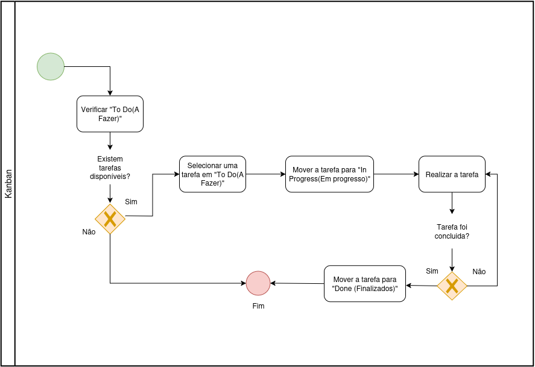

# 1.3.1. Modelagem BPMN da Metodologia

## Modelagem BPMN - Scrum XP

### 1. Introdução a Integração Scrum XP

#### O que é Scrum?

O Scrum é um framework ágil para gerenciamento de projetos que se concentra em entregas iterativas e incrementais. Ele define uma estrutura de trabalho com papéis claros, eventos regulares e artefatos específicos. O Scrum divide o trabalho em períodos fixos chamados Sprints, geralmente de 1 a 4 semanas, durante os quais uma versão potencialmente entregável do produto é desenvolvida.

Para uma descrição mais detalhada do Scrum e como ele será adaptado ao nosso contexto, consulte nossa [documentação detalhada sobre Scrum XP](/docs/assets/scrum-xp/scrum_xp_content.md). *COMENTARIO: como ainda nao sabemos o que vamos adapater, deixei assim pra mandar pra outra pagina, mas podemos deixar tudo aqui*

##### Elementos-chave do Scrum:

- **Papéis**: Product Owner, Scrum Master, Time de Desenvolvimento
- **Eventos**: Sprint Planning, Daily Scrum, Sprint Review, Sprint Retrospective
- **Artefatos**: Product Backlog, Sprint Backlog, Incremento

> **Nota de Adaptação:** Para o projeto EuRecomendo, adaptaremos o Scrum às nossas necessidades específicas. Não realizaremos Daily Scrums formais e possivelmente não teremos papéis bem definidos de Product Owner e Scrum Master.

#### O que é Extreme Programming (XP)?

O Extreme Programming (XP) é uma metodologia ágil que se concentra nas práticas técnicas de desenvolvimento de software. O XP busca melhorar a qualidade do software e a capacidade de resposta às mudanças nas necessidades do cliente. Ele enfatiza a simplicidade, a comunicação, o feedback constante e a coragem para enfrentar mudanças.

Para mais detalhes sobre como implementamos as práticas de XP, consulte nossa [documentação sobre XP](/docs/assets/scrum-xp/scrum_xp_content.md). *COMENTARIO: mesma coisa do scrum pae*

##### Práticas-chave do XP:

- [**Programação em pares**](/docs/assets/scrum-xp/daily_workflow_process.md): Dois desenvolvedores trabalhando juntos em uma estação
- [**Desenvolvimento orientado a testes (TDD)**](/docs/assets/scrum-xp/daily_workflow_process.md): Escrever testes antes do código de produção *COMENTARIO: tem que ve se vamo fazer mesmo, nn curto TDD, mas o xp us*
- [**Integração contínua**](/docs/assets/scrum-xp/continuous_integration_process.md): Integração frequente do código ao repositório principal
- **Design simples**: Manter o código o mais simples possível
- **Refatoração contínua**: Melhorar constantemente o código existente *COMENTARIO: talvez a gente nn precise falar sobre refatoração, acho que ao longo do sema s nn tem tempo pra isso*
- **Pequenas releases**

#### Como Scrum e XP se complementam

A integração Scrum XP combina o gerenciamento de projeto do Scrum com as práticas técnicas do XP, criando uma abordagem mais completa para o desenvolvimento ágil. Enquanto o Scrum fornece estrutura e organização para o projeto, o XP contribui com práticas de engenharia que melhoram a qualidade do código e a eficiência do desenvolvimento.

##### Benefícios da abordagem combinada:

- **Gerenciamento eficaz** + **Qualidade técnica superior**
- **Planejamento estruturado** + **Práticas de codificação rigorosas**
- **Organização da equipe** + **Excelência em engenharia de software**

### 2. Componentes-chave do Scrum XP

#### Elementos do Scrum no Scrum XP

- **Sprint**: Ciclo de desenvolvimento com duração fixa (1-4 semanas)
- **Product Backlog**: Lista priorizada de todas as funcionalidades desejadas
- **Sprint Backlog**: Conjunto de itens do Product Backlog selecionados para o Sprint
- **User Stories**: Descrições concisas de funcionalidades do ponto de vista do usuário
*COMENTARIO: a gente vai usar tudo isso mesmo? tem que verificar*

#### Elementos do XP no Scrum XP

- [**Programação em Pares**](/docs/assets/scrum-xp/daily_workflow_process.md): Dois desenvolvedores trabalhando juntos em uma estação
- [**Integração Contínua**](/docs/assets/scrum-xp/continuous_integration_process.md): Integração frequente do código ao repositório principal
*COMENTARIO: same pras duas abaixo*
- [**Test-Driven Development (TDD)**](/docs/assets/scrum-xp/daily_workflow_process.md): Escrever testes antes do código de produção
- **Refatoração**: Melhorar continuamente o design do código sem alterar seu comportamento

#### Práticas Combinadas

- **Iterações Curtas**: Sprints curtos que entregam incrementos funcionais
- **Envolvimento do Cliente**: Product Owner acessível e feedback constante *COMENTARIO: nem cliente nois tem ta*
- **Feedback Contínuo**: Através de comunicação constante e programação em pares *COMENTARIO: feedback de qual cliente? rs*
- **Qualidade Técnica**: Uso de TDD e refatoração para manter alta qualidade de código *COMENTARIO: verifica la*

### 3. Processo BPMN do Scrum XP

#### Fase de Inicialização do Projeto
- Definição da visão do produto
- Criação inicial do Product Backlog
- Formação da equipe Scrum XP
- Estabelecimento de padrões de código e práticas de desenvolvimento

#### Processo de Planejamento do Sprint
- Refinamento do Product Backlog
- Seleção de User Stories para o Sprint
- Estimativa de esforço
- Definição de critérios de aceitação
- Criação do Sprint Backlog

#### Fluxo de Trabalho Diário
- Comunicação contínua
- Programação em pares
- Desenvolvimento orientado a testes
- Integração contínua
- Refatoração

#### Processo de Testes e Garantia de Qualidade
- Testes unitários automatizados
- Testes de aceitação
- Integração contínua
- Revisão de código

#### Sprint Review e Retrospectiva
- Demonstração do incremento
- Feedback dos stakeholders
- Retrospectiva do Sprint
- Adaptação e melhoria do processo

#### Processo de Release
- Preparação final para entrega
- Testes de aceitação do usuário
- Documentação
- Implantação
- Monitoramento pós-implantação

### 4. Aplicação no Projeto EuRecomendo

#### Estrutura da Equipe e Papéis (Adaptados)

Para o projeto EuRecomendo, adaptaremos o Scrum para atender às nossas necessidades específicas:

- **Papéis Flexíveis**: Ao contrário do Scrum tradicional, não teremos necessariamente um Product Owner e Scrum Master bem definidos. As responsabilidades desses papéis serão distribuídas entre os membros da equipe conforme necessário.
- **Time de Desenvolvimento**: Todos os membros da equipe contribuirão para o desenvolvimento, utilizando práticas de XP como programação em pares quando apropriado.

#### Cadência e Planejamento de Sprint
- Sprints de 2 semanas
- [Planejamento de Sprint](/docs/assets/scrum-xp/sprint_planning_process.md) às segundas-feiras
- **Sem Daily Scrums**: Em vez de reuniões diárias formais, manteremos comunicação contínua através de canais assíncronos (Slack) e reuniões ad hoc quando necessário
- [Sprint Review e Retrospectiva](/docs/assets/scrum-xp/review_retrospective_process.md) às sextas-feiras ao final do Sprint

#### Adoção de Práticas Técnicas
- [Programação em pares](/docs/assets/scrum-xp/daily_workflow_process.md) para User Stories complexas
- [TDD](/docs/assets/scrum-xp/daily_workflow_process.md) para funcionalidades críticas
- [Integração contínua](/docs/assets/scrum-xp/continuous_integration_process.md) com testes automatizados
- Refatoração contínua do código

#### Mecanismos de Controle de Qualidade
- Padrões de código definidos e seguidos pela equipe
- Revisão de código antes da integração
- Testes automatizados com cobertura mínima de 80% *COMENTARIO: kkkkkkkk vai ter é ?*
- Métricas de qualidade de código monitoradas continuamente 

#### Ferramentas de Comunicação e Colaboração
- GitHub para controle de versão e integração contínua
- GitHub para gerenciamento de backlog e acompanhamento de sprints e tarefas
- Whatszap para comunicação em tempo real

### 5. BPMN Diagramas

Os diagramas BPMN do processo Scrum XP estão disponíveis nas seguintes seções:

- [Processo Geral Scrum XP](/docs/assets/scrum-xp/scrum_xp_process.png) ([Documentação](/docs/assets/scrum-xp/scrum_xp_process.md))
- [Processo de Planejamento de Sprint](/docs/assets/scrum-xp/sprint_planning_process.png) ([Documentação](/docs/assets/scrum-xp/sprint_planning_process.md))
- [Fluxo de Trabalho Diário](/docs/assets/scrum-xp/daily_workflow_process.png) ([Documentação](/docs/assets/scrum-xp/daily_workflow_process.md))
- [Processo de Review e Retrospectiva](/docs/assets/scrum-xp/review_retrospective_process.png) ([Documentação](/docs/assets/scrum-xp/review_retrospective_process.md))
- [Processo de Integração Contínua](/docs/assets/scrum-xp/continuous_integration_process.png) ([Documentação](/docs/assets/scrum-xp/continuous_integration_process.md))
- [Processo Kanban](/docs/assets/kanban/kanban_process.png) ([Documentação](/docs/assets/kanban/kanban_process.md))

Para uma visão mais detalhada de nossa implementação Scrum XP, consulte a [documentação completa](/docs/assets/scrum-xp/scrum_xp_content.md).

## Modelagem BPMN - Kanban

### 1. Introdução ao Kanban

#### O que é Kanban?

O Kanban é um sistema visual de gerenciamento de fluxo de trabalho que tem suas raízes no Sistema Toyota de Produção. A palavra "Kanban" significa "cartão visual" ou "sinalização" em japonês. Este método se concentra na visualização do trabalho, limitação do trabalho em progresso (WIP - Work in Progress) e maximização da eficiência através do fluxo contínuo.

Diferentemente do Scrum, que trabalha com iterações fixas (Sprints), o Kanban opera como um sistema de fluxo contínuo, onde o trabalho é "puxado" através do sistema conforme a capacidade se torna disponível.

#### Princípios Fundamentais do Kanban

1. **Visualizar o fluxo de trabalho**: Tornar o trabalho e seu fluxo visível para todos
2. **Limitar o trabalho em progresso**: Estabelecer limites para a quantidade de trabalho em cada etapa
3. **Gerenciar e medir o fluxo**: Monitorar, medir e reportar o fluxo de trabalho
4. **Tornar as políticas explícitas**: Definir claramente as regras e critérios para cada etapa
5. **Usar modelos para reconhecer oportunidades de melhoria**: Aplicar métodos científicos para mudanças evolutivas
6. **Melhorar colaborativamente**: Evoluir experimentalmente usando modelos e métodos científicos

### 2. Componentes-chave do Kanban

#### Quadro Kanban

O quadro Kanban é a ferramenta visual central que mostra todo o fluxo de trabalho. Tradicionalmente dividido em colunas que representam diferentes etapas do processo:

- **Backlog/To Do**: Itens aguardando para serem iniciados
- **In Progress/Doing**: Trabalho em andamento
- **Review/Testing**: Itens em revisão ou teste
- **Done**: Trabalho concluído

#### Cartões Kanban

Cada item de trabalho é representado por um cartão que contém:
- Descrição da tarefa
- Responsável
- Prioridade
- Estimativa de esforço
- Critérios de aceitação
- Data de criação e prazo

#### Limites WIP (Work in Progress)

São restrições impostas sobre quantos itens podem estar em uma determinada etapa simultaneamente. Estes limites ajudam a:
- Identificar gargalos no processo
- Manter o foco da equipe
- Melhorar a qualidade do trabalho
- Acelerar o tempo de entrega

#### Métricas de Fluxo

- **Lead Time**: Tempo total desde a criação do item até sua conclusão
- **Cycle Time**: Tempo que um item leva para ser processado ativamente
- **Throughput**: Quantidade de itens concluídos em um período específico
- **WIP**: Quantidade atual de trabalho em progresso

### 3. Processo BPMN do Kanban

#### Processo de Entrada de Demandas
- Criação de novos itens no backlog
- Priorização baseada em valor e urgência
- Análise inicial de requisitos
- Adição ao quadro Kanban

#### Fluxo de Trabalho Contínuo
- Movimentação de cartões através das colunas
- Respeito aos limites WIP estabelecidos
- Identificação e resolução de bloqueios
- Colaboração contínua entre membros da equipe

#### Processo de Revisão e Melhoria
- Reuniões de revisão do quadro (daily standups opcionais)
- Análise de métricas de fluxo
- Identificação de gargalos e oportunidades de melhoria
- Ajustes no processo e limites WIP

#### Gestão de Bloqueios
- Identificação rápida de impedimentos
- Escalação para resolução
- Documentação de problemas recorrentes
- Implementação de medidas preventivas

### 4. Aplicação no Projeto EuRecomendo

#### Estrutura do Quadro Kanban

Para o projeto EuRecomendo, implementaremos um quadro Kanban adaptado às nossas necessidades:

**Colunas do Quadro:**
1. **To do**: Funcionalidades e melhorias identificadas
2. **In Progress**: Código sendo desenvolvido
3. **Done**: Funcionalidades implementadas e entregues

#### Limites WIP Propostos

- **Ready**: 5 itens máximo
- **In Progress**: 3 itens máximo (baseado no tamanho da equipe)
- **Code Review**: 2 itens máximo

#### Políticas Explícitas

**Critérios para "Ready":**
- Requisitos claramente definidos
- Critérios de aceitação estabelecidos
- Dependências identificadas
- Estimativa de esforço realizada

**Critérios para "Done":**
- Código implementado e revisado
- Testes automatizados criados e passando
- Documentação atualizada
- Funcionalidade testada e aprovada

#### Cadência de Reuniões

- **Daily Standup** (opcional): Revisão rápida do quadro e identificação de bloqueios
- **Replenishment Meeting** (semanal): Priorização e adição de novos itens ao backlog
- **Review Meeting** (bi-semanal): Análise de métricas e identificação de melhorias

#### Integração com Ferramentas

- **GitHub Projects**: Para implementação do quadro Kanban digital
- **GitHub Issues**: Como cartões individuais de trabalho
- **GitHub Actions**: Para automação de transições entre colunas
- **Métricas**: Tracking através de ferramentas nativas do GitHub

### 5. BPMN Diagrama do Processo Kanban

<b>Figura 1:</b> Diagrama BPMN do processo Kanban

<b>Autor:</b> <a href="https://github.com/potatoyz908">Euller Júlio</a>, 2025

O diagrama BPMN acima ilustra o fluxo contínuo do processo Kanban, mostrando como os itens de trabalho fluem através das diferentes etapas, os pontos de decisão para movimentação entre colunas, e os mecanismos de controle de qualidade implementados.

Para uma documentação detalhada do diagrama, consulte a [documentação do processo Kanban](/docs/assets/kanban/kanban_process.md).

## Bibliografia

SCRUM.ORG. What is Scrum? Disponível em: https://www.scrum.org/resources/what-is-scrum. Acesso em: 4 set. 2025.

BECK, Kent. Extreme Programming Explained: Embrace Change. 2nd Edition. Addison-Wesley Professional, 2004.

SUTHERLAND, Jeff; SCHWABER, Ken. The Scrum Guide. Disponível em: https://scrumguides.org/scrum-guide.html. Acesso em: 4 set. 2025.

KNIBERG, Henrik. Scrum and XP from the Trenches. InfoQ, 2007. Disponível em: https://www.infoq.com/minibooks/scrum-xp-from-the-trenches/. Acesso em: 4 set. 2025.

ANDERSON, David J. Kanban: Successful Evolutionary Change for Your Technology Business. Blue Hole Press, 2010.

BRECHNER, Eric. Agile Project Management with Kanban. Microsoft Press, 2015.

KANBAN UNIVERSITY. What is Kanban? Disponível em: https://kanban.university/what-is-kanban/. Acesso em: 4 set. 2025.

ATLASSIAN. Kanban vs Scrum. Disponível em: https://www.atlassian.com/agile/kanban/kanban-vs-scrum. Acesso em: 4 set. 2025.

### Histórico de versão

| Versão | Data | Descrição | Autor(es) |
|--------|------|-----------|-----------|
| 1.0 | 04/09/2025 | Criação do documento de Modelagem BPMN da Metodologia Scrum XP | [Luis Lima](https://github.com/luidooo) |
| 1.1 | 04/09/2025 | Adição da seção Modelagem BPMN - Kanban com processo completo e documentação | [Euller Júlio](https://github.com/potatoyz908) |
